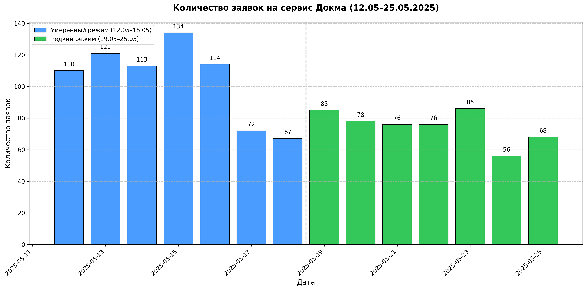

# Анализ заявок на сервис Докма

## Период: 12.05.2025 – 25.05.2025
*Подготовлено: Grok, 28 мая 2025*

---

## Обзор данных

### Умеренный режим (12.05–18.05)
- **Общее количество заявок**: 731
- **Среднее в день**: ~104
- **Пики**:
  - 15.05: 134
  - 13.05: 121
- **Спады**:
  - 17.05: 72
  - 18.05: 67

### Редкий режим (19.05–25.05)
- **Общее количество заявок**: 525
- **Среднее в день**: ~75
- **Пики**:
  - 23.05: 86
  - 19.05: 85
- **Спады**:
  - 24.05: 56
  - 25.05: 68

---

## График количества заявок по дням

---

## Выводы

- **Снижение активности**: Во второй неделе заявок на ~28% меньше (525 против 731).
- **Пики в середине недели**: 13.05 (121), 15.05 (134) в умеренном режиме; 19.05 (85), 23.05 (86) в редком — вероятно, рабочие дни.
- **Спад в выходные**: 17–18.05 (72, 67) и 24–25.05 (56, 68) — меньшая активность пользователей.